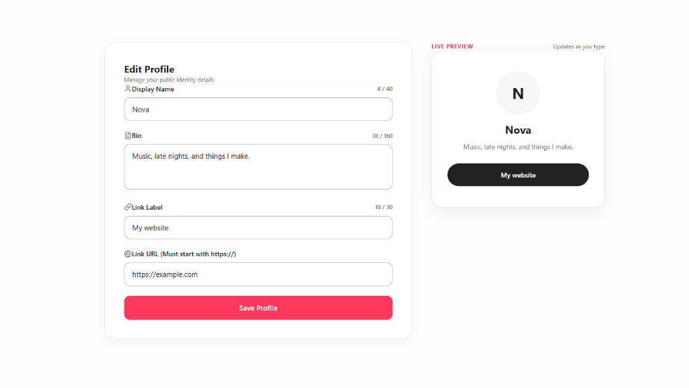

# misa.lol — Mini Profile Editor

Full-stack mini profile editor built with **FastAPI** (Python backend), **Vite + React + TypeScript** (frontend), and **Docker Compose** containerization with Nginx.

---

## Live Preview & Demo



### Demo Video
> *(Video placeholder — insert video link or embedded MP4 here)*

---

## Quick Start & Run Commands

### Option A: Running via Docker Compose (Recommended)

**Requirements:** Docker 20.10+ & Docker Compose v2+

```bash
# 1. Clone or extract repository and navigate into folder
cd misa.trial

# 2. Build and start containers in detached mode
docker-compose up --build -d

# 3. Access the application:
# Frontend: http://localhost:5173 (or http://localhost:80)
# Backend API: http://localhost:8000/api/profile
# OpenAPI Interactive Docs: http://localhost:8000/docs
```

To stop containers:
```bash
docker-compose down
```

---

### Option B: Running Locally (Development Mode without Docker)

**Requirements:** Python 3.10+ and Node.js 18+

#### 1. Backend (FastAPI)
```bash
cd backend
pip install -r requirements.txt
python -m uvicorn main:app --reload --port 8000
```
Backend API will run at `http://localhost:8000`.

#### 2. Frontend (Vite + React)
```bash
cd frontend
npm install
npm run dev
```
Frontend app will run at `http://localhost:5173`.

#### 3. Run Test Suites
```bash
# Backend Pytest
cd backend
python -m pytest test_api.py

# Frontend Vitest
cd frontend
npm test
```

---

## Summary & Time Allocation

- **Time Spent:** ~45 minutes total.
- **What Works:**
  - `GET /api/profile` and `PUT /api/profile` API endpoints following contract.
  - Strict server-side validation for types, character lengths, and `https://` URLs.
  - Live profile card preview updating in real-time as user types.
  - Client-side URL validity check toggling clickable link button vs disabled invalid URL badge.
  - Save button with pending spinner, submission locking, and success confirmation banner.
  - Form state preservation on save failure so users can correct entries easily.
  - Data persistence across browser refresh (loads saved state from FastAPI memory store).
  - Airbnb UI Design System (Light Theme) with Inter typography and side-by-side card layout.
  - Full mobile responsiveness and accessible keyboard navigation.
  - 100% passing automated test suites (`backend/test_api.py` and `frontend/src/utils/urlValidator.test.ts`).
- **Unfinished:** None. All specified requirements and backend contract rules are complete.

---

## Validation & Verification Results

### 1. Successful Save & Browser Refresh Check
- **Action:** Updated profile to `displayName: "Nova Star"`, `bio: "Creating music and code."`, `link.label: "Portfolio"`, `link.url: "https://nova.dev"`, and clicked **Save Changes**.
- **Result:** Backend returned `200 OK` with saved object. Success banner displayed. Refreshed browser window (`F5`), and `GET /api/profile` reloaded saved data (`Nova Star`).

### 2. Invalid Request Sent Directly to API
- **Action:** Sent direct `PUT /api/profile` request with invalid scheme `http://example.com` and `displayName` > 40 characters:
  ```bash
  curl -X PUT http://localhost:8000/api/profile \
    -H "Content-Type: application/json" \
    -d '{"displayName": "Very Long Name That Exceeds Forty Characters Limit", "bio": "Bio", "link": {"label": "Site", "url": "http://example.com"}}'
  ```
- **Result:** API responded with `400 Bad Request`:
  ```json
  {
    "error": "Validation failed",
    "details": {
      "displayName": "Display name must be between 1 and 40 characters after trimming.",
      "link.url": "Link URL must start with 'https://'."
    }
  }
  ```
- **State Check:** Performed `GET /api/profile`. The stored profile remained **unchanged** (`Nova`).

---

## Libraries & Tools Used

- **Backend:** FastAPI, Pydantic, Uvicorn, Pytest, HTTPX.
- **Frontend:** React 18, TypeScript, Vite, Vitest, Nginx, Lucide React icons, Tailwind CSS / Airbnb Light UI Design System.
- **Orchestration:** Docker & Docker Compose.
